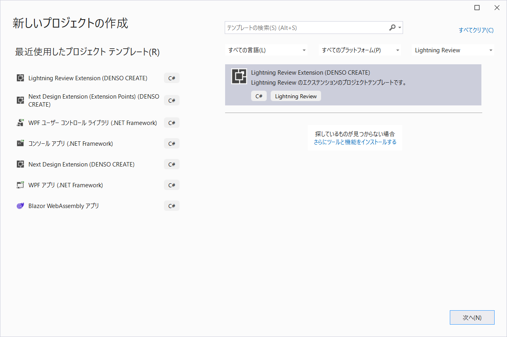

# Lightning Review Extension Project Templates

- [概要](#概要)
- [リリースノート](#リリースノート)
- [利用方法](#利用方法)
- [テンプレートの開発](#テンプレートの開発)
- [nuget.orgへのパッケージの公開方法](#nugetorgへのパッケージの公開方法)
  - [ローカルから公開する方法](#ローカルから公開する方法)
  - [Github Actionsによる公開](#github-actionsによる公開)
- [ライセンス](#ライセンス)

## 概要
* Lightning Reviewのエクステンション開発のためのプロジェクトテンプレートです。
* dotnetのCLIおよび、Visual Studioで利用できます。
* [Nuget.orgで公開]()しています。
  
> **Notice:**
> 本ライブラリはLightning Review V2.0.0以降が対象のプロジェクトテンプレートです。Lightning Review V1.Xでは利用できません。

## リリースノート
* バージョンごとの変更点については、[リリースノート](releasenotes.md)を参照して下さい。

## 利用方法
インストールすると、Visual Studioで次のようにプロジェクトテンプレートを選択できるようになります。

インストール方法はこちらの[readme](src/readme.md)を参照して下さい。

> **Notice:**
> Visual Studio 2019と2022の両方の環境をインストールした場合は、Visual Studio 2022でのみプロジェクトテンプレートが表示されるようになります。

使い方について説明した動画はこちらです。

## テンプレートの開発
プロジェクトテンプレートについては次の記事を参考にして下さい。
* [dotnet new のカスタム テンプレート](https://docs.microsoft.com/ja-jp/dotnet/core/tools/custom-templates)
* [.NET CLI Templates in Visual Studio](https://devblogs.microsoft.com/dotnet/net-cli-templates-in-visual-studio/)
* [how to create templates that work in dotnet new and Visual Studio/Visual Studio for Mac](https://github.com/sayedihashimi/template-sample)
* [How do I ship multiple `dotnet new` templates inside a single NuGet package?])https://stackoverflow.com/questions/58325232/how-do-i-ship-multiple-dotnet-new-templates-inside-a-single-nuget-package)

## nuget.orgへのパッケージの公開方法

### ローカルから公開する方法
1. 事前準備
   * nuget.orgで `densocreate`の組織に所属するアカウントを登録して下さい。
   * nuget.orgの管理ページからApiキーを取得し、環境変数 `NUGET_APIKEY` をセットして下さい。
2. 公開
   * `publish.cmd`を実行して下さい。

### Github Actionsによる公開
* [publish to nugetアクション](https://github.com/denso-create/LightningReview-Extension-ProjectTemplates/actions/workflows/publish.yml)を用いて下さい。

## ライセンス
本ライブラリはMITライセンスです。詳細は[LICENSE](./LICENSE) を確認してください。
